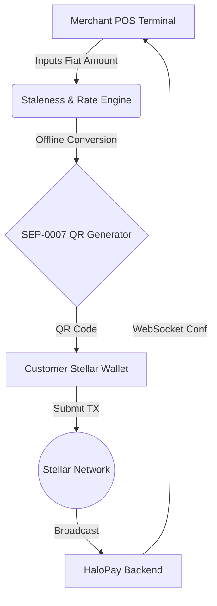

<!-- Optional: replace with a banner image. Keep it plain — a wordmark, not a stock illustration. -->
<h1 align="center">HaloPay Merchant POS</h1>

<p align="center">
  An offline-first Progressive Web Application (PWA) enabling local brick-and-mortar merchants in emerging markets to accept USDC payments over the Stellar network with instant fiat exchange rate conversions. Designed specifically for low-cost Android POS devices and smartphones with limited connectivity, it guarantees payment terminal operation even when internet connectivity drops.
</p>

<p align="center">
  <a href="https://github.com/HaloPaye/halopay-pos/actions"></a>
  
  
  
</p>

---

## Key Features

* **Offline SEP-0007 Payment URI Generator**: Instantly formats standard `web+stellar:pay` QR codes with custom destination address, USDC asset parameters, memo tracking, and converted crypto amounts.
* **Cached Rate Engine & Staleness Indicator**: Manages offline fiat exchange rates (e.g. XAF to USDC) with visual staleness banners (`"Rate updated 14 minutes ago"`, alert threshold warnings).
* **Large-Touch Target Keypad**: Custom responsive touch keypad optimized for 480p/720p low-end Android touch screens with haptic press simulation.
* **Real-time WebSocket Listener**: Listens for on-chain Stellar transaction confirmations broadcast by the HaloPay settlement backend, displaying instant high-visibility payment completion toasts.
* **PWA Service Worker**: Full app shell pre-caching and offline capability via `manifest.json` and `sw.js`.
* **Merchant Configuration**: Easily update merchant name, Stellar public key, base fiat currency, USDC issuer address, and WebSocket endpoint.

### Deep Dive: Offline-First Architecture

The defining feature of HaloPay POS is its ability to operate completely isolated from the internet during point-of-sale interactions. 

- **Service Worker Caching**: All UI components, fonts, and scripts are aggressively cached by a PWA service worker. The terminal can be launched from a mobile home screen even with cellular data completely turned off.
- **Algorithmic Rate Staleness**: The application caches the latest XAF/USDC exchange rate in `localStorage`. If the network is unavailable, the application uses this cached rate to calculate the exact crypto equivalent of the merchant's fiat price. A built-in staleness algorithm warns the merchant if the cached rate has drifted past 24 hours, mitigating severe volatility risk.
- **Deterministic URI Generation**: When the merchant generates a QR code, the application relies on the SEP-0007 specification. It formats a `web+stellar:pay` URI entirely locally. 
- **Customer as the Relay**: Because the QR code contains the exact destination address, amount, and asset issuer, the *customer* becomes the relayer. The customer scans the code with their internet-connected Stellar wallet (e.g., Lobstr) and submits the transaction to the ledger. The merchant never needs an internet connection to authorize the sale.

---

## Architecture Diagram



---

## Repository Structure

```
halopay-pos/
├── public/
│   ├── manifest.json              # PWA Web App Manifest
│   └── sw.js                      # Service Worker caching engine
├── src/
│   ├── app/
│   │   ├── globals.css            # Tailwind directives & aesthetics
│   │   ├── layout.tsx             # Root layout with PWA meta & SW registration
│   │   ├── page.tsx               # Marketing Landing Page
│   │   └── pos/page.tsx           # Main POS terminal application screen
│   ├── components/
│   │   ├── Keypad.tsx             # Large touch target keypad component
│   │   ├── MerchantConfigModal.tsx# Merchant setup & Stellar key configuration
│   │   ├── PaymentNotification.tsx# WebSocket live payment confirmation listener
│   │   ├── PaymentQRModal.tsx     # High-contrast SEP-0007 QR modal
│   │   └── StalenessIndicator.tsx # Offline rate staleness UI banner
│   └── lib/
│       ├── exchange-rate.ts       # Rate conversion & staleness math engine
│       ├── qr-generator.ts        # SEP-0007 URI generator & parser
│       └── storage.ts             # LocalStorage wrapper for settings & rates
├── tests/
│   └── exchange-rate.test.ts      # Unit tests for staleness & SEP-0007 URIs
├── scripts/
│   └── create_issues.ps1          # GitHub CLI issue creation script
├── CONTRIBUTING.md                # Contribution guidelines & commit standards
├── SECURITY.md                    # Security vulnerability reporting policy
├── jest.config.js                 # Jest unit testing configuration
├── tailwind.config.js             # Tailwind CSS theme configuration
└── package.json                   # Dependencies & build scripts
```

---

## Environment Variables

| Variable | Description | Default |
| -------- | ----------- | ------- |
| `NEXT_PUBLIC_WS_URL` | WebSocket URL for transaction confirmations | `wss://api.halopay.io/ws` |
| `NEXT_PUBLIC_HORIZON_URL` | Stellar Horizon server URL | `https://horizon.stellar.org` |

---

## Quick Start

### Prerequisites

* Node.js v18.x or higher
* npm or pnpm

### 1. Install Dependencies

```bash
npm install
```

### 2. Run Development Server

```bash
npm run dev
```

Open [http://localhost:3000](http://localhost:3000) in your browser or install on mobile via **Add to Home Screen**.

### 3. Run Unit Tests

```bash
npm test
```

### 4. Build for Production

```bash
npm run build
npm start
```

---

## SEP-0007 Payment Flow

1. Merchant enters total sale amount in local currency (e.g. `5,000 XAF`).
2. Terminal converts `5,000 XAF` to `≈ 8.12 USDC` using the cached exchange rate (e.g. `615.5 XAF/USDC`).
3. Tapping **Generate Payment QR** creates a standard SEP-0007 Stellar payment URI:
   ```
   web+stellar:pay?destination=GBCW66G...&amount=8.12&asset_code=USDC&asset_issuer=GBBD47I...&memo=HALO-LN8K-A29&memo_type=MEMO_TEXT
   ```
4. Customer scans QR code with any Stellar wallet (e.g., LOBSTR, Beans, Vibrant) to confirm.
5. The POS terminal's WebSocket listener receives instant confirmation from Horizon / HaloPay API server and displays a success notification with haptic feedback.

---

## Maintainers

* **HaloPay Dev Team** - devs@halopay.io

## Contributors

[](https://github.com/HaloPaye/halopay-pos/graphs/contributors)

---

## License

Distributed under the MIT License. See `LICENSE` for more information.
