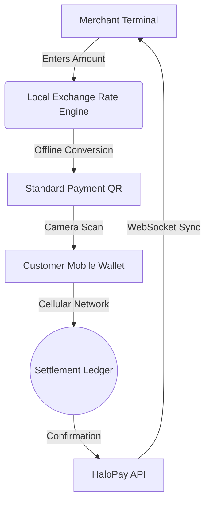

# HaloPay Merchant POS

An offline-first Progressive Web Application (PWA) payment terminal enabling retail merchants to accept digital payments in low-connectivity environments.

[](https://github.com/HaloPaye/halopay-pos/actions)
[](LICENSE)
[](https://nextjs.org)
[](https://www.typescriptlang.org)

---

## Overview

HaloPay POS is built specifically for low-end touch devices, smartphones, and dedicated point-of-sale hardware operating in areas with unstable or nonexistent internet access.

Traditional payment terminals freeze when telecommunication towers fail. HaloPay POS decouples payment request generation from active connectivity, allowing transactions to proceed uninterrupted.

---

## How It Works



1. **Local Payment QR Generation:** When a sale amount is entered, the terminal computes the conversion locally using cached exchange rates and renders a standard payment URI QR code entirely on-device.
2. **Customer-as-Relayer:** Customers scan the terminal QR with their personal mobile wallet. The customer's device (which often has cellular data or roaming) relays the signed transaction directly to the settlement network. The merchant terminal requires zero active internet to initiate and accept payments.
3. **Store-and-Forward Sync:** If neither party has internet access, the terminal stores encrypted transaction receipts locally in IndexedDB and automatically synchronizes when connected to an internet gateway or nearby mesh relayer.

---

## Key Features

* **Zero-Connection Operation:** Full app shell pre-cached via PWA service workers. Launches and operates completely offline.
* **Cached Rate Engine with Staleness Alerts:** Computes local fiat to digital asset rates with visual staleness indicators (`"Rate updated 18 mins ago"`) to protect merchants from pricing drift.
* **Multi-Sensory Merchant Feedback:** Synchronized visual animations, synthesized Web Audio confirmation chimes, and haptic vibration patterns designed for noisy retail environments.
* **Encrypted Offline Queue:** Vouchers and receipts are stored securely in client-side IndexedDB with atomic deduplication.
* **Ruggedized Touch Keypad:** Ergonomic virtual keypad with large touch targets optimized for 480p/720p hardware displays.
* **ESC/POS Receipt Printer Integration:** Binary protocol drivers for generating printed receipts over Bluetooth thermal printers.

---

## Quick Start

### Prerequisites
- Node.js v18 or higher
- npm v9 or higher

### Development Setup

```bash
# Clone the repository
git clone https://github.com/HaloPaye/halopay-pos.git
cd halopay-pos

# Install dependencies
npm install

# Run development server
npm run dev

# Run unit tests and lint checks
npm test
npm run lint

# Build production bundle
npm run build
```

Navigate to `http://localhost:3000` to launch the POS terminal simulator.

---

## Configuration

Terminal parameters can be configured directly in `src/config/index.ts` or via the merchant settings panel:
- `merchantName`: Merchant business display name.
- `baseCurrency`: Local fiat display currency (e.g. `USD`, `EUR`, `XAF`, `NGN`).
- `settlementAsset`: Underlying digital settlement asset (e.g. `USDC`).
- `apiEndpoint`: WebSocket & HTTP endpoint for payment confirmation feeds.

---

## License

This project is licensed under the MIT License - see the [LICENSE](LICENSE) file for details.
